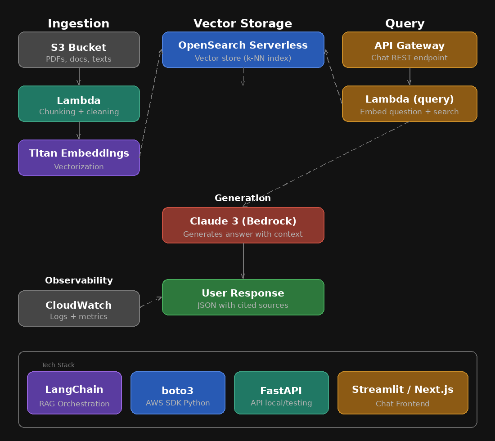

# RAG with AWS Bedrock

Question-answering system over your own documents using **Retrieval-Augmented Generation** on AWS.

## Stack
| Layer | Service |
|-------|---------|
| Document storage | S3 |
| Embeddings | Amazon Titan Embeddings v2 |
| Vector store | OpenSearch Serverless |
| LLM | Claude 3 Haiku (Bedrock) |
| Orchestration | LangChain |
| API | FastAPI |
| Frontend | Streamlit |

## Architecture



## Project Structure
```
rag-bedrock/
├── ingesta/
│   ├── upload.py          # Upload PDFs to S3
│   └── pipeline.py        # Chunking → embeddings → OpenSearch
├── query/
│   ├── retriever.py       # Semantic search in OpenSearch
│   └── chain.py           # RAG chain with LangChain + Claude
├── frontend/
│   └── app.py             # Streamlit chat UI
├── infra/
│   └── setup.py           # Create OpenSearch index
├── tests/
│   └── test_chain.py      # Basic tests
├── .env.example
└── requirements.txt
```

## Quick Setup

```bash
# 1. Install dependencies
pip install -r requirements.txt

# 2. Configure credentials
cp .env.example .env
# Fill in AWS_ACCESS_KEY_ID, AWS_SECRET_ACCESS_KEY, etc.

# 3. Create infrastructure (run once)
python infra/setup.py

# 4. Upload documents
python ingesta/upload.py --path ./my-docs/

# 5. Index documents
python ingesta/pipeline.py

# 6. Start the frontend
python -m streamlit run frontend/app.py
```

> **Windows users:** use `\` instead of `/` in paths.

## Flow

```
PDF → S3 → chunks → Titan Embeddings → OpenSearch
                                              ↓
Question → embed → k-NN search → context → Claude → answer + sources
```

## 💸 Donations
If you'd like to support this project:
- 🇦🇷 ARS (Argentina)  
  Alias: `lazaro.503.alaba.mp`
- 🌎 USD (Argentina only, local transfers)  
  Alias: `ahogada.duras.foca`
